# Hybrid GA + BO PID

Open **Automation → Hybrid GA + BO PID**. This fifth page keeps the four
existing pages available. It uses calibrated beam current in nA as feedback
and the selected TC1–TC12 command in A as its actuator. The existing C++
NLAPID and ControlService execute every trial; Python coordinates experiments.

## Workflow

### State definitions

The optimizer uses `HybridState` and stores its current state in `self.state`.

| State | Meaning | Next state |
| --- | --- | --- |
| BASELINE | Repeat starting gains to estimate cost and beam-error noise. | GA after baseline repeats. |
| GA | Evaluate and evolve GA gains; collect measurements for BO. | CHALLENGER when a BO prediction clears the proposal gate. |
| CHALLENGER | Measure the proposed BO gains. | CONFIRMATION if measured cost, error and response checks pass; otherwise GA. |
| CONFIRMATION | Complete randomized incumbent/BO repeat pairs. | BO if all handover checks pass; otherwise GA. |
| BO | Select gains using BO. | GA if improvement stalls or predictions repeatedly miss. |
| STOPPED | No further candidates may be proposed after a fault or reference drift. | A new session is required. |

Reference and exploration identify **trial sources**, while the optimizer stays
in GA or BO. Recovery and Validation are page execution states surrounding search
trials; they are not optimizer states. Budget exhaustion ends search without
changing its last optimizer state, and cannot promote an incomplete confirmation.
New history, event, CSV and database JSON records use the `state` key. Existing
export files are retained as originally written.

### State machine and transitions

Read each transition as **current state + event + condition → next state + action**.
An event is usually a completed trial. The exception is GA → CHALLENGER, which
happens when a promising BO candidate is proposed, before its response is measured.
Only one candidate may be outstanding; its result must be recorded before another
is proposed. Remaining in a state means continuing its work, not restarting it.

```mermaid
stateDiagram-v2
    [*] --> BASELINE: Create a new session
    BASELINE --> BASELINE: More baseline repeats needed
    BASELINE --> GA: Baseline repeats complete
    GA --> GA: Evaluate population and evolve generations
    GA --> CHALLENGER: Enough diverse data and prediction clears margin
    CHALLENGER --> CONFIRMATION: Measured cost and error improve; response passes
    CHALLENGER --> GA: Valid trial fails improvement or response checks
    CONFIRMATION --> CONFIRMATION: More paired trials needed
    CONFIRMATION --> BO: All pairs complete and handover checks pass
    CONFIRMATION --> GA: Completed pairs fail handover checks
    BO --> BO: Neither fallback threshold reached
    BO --> GA: Cost stalls or three consecutive prediction misses
    BASELINE --> STOPPED: Invalid trial
    GA --> STOPPED: Invalid trial or reference drift
    CHALLENGER --> STOPPED: Invalid trial
    CONFIRMATION --> STOPPED: Invalid trial
    BO --> STOPPED: Invalid trial or reference drift
    STOPPED --> [*]: End this search session
```



The diagram shows optimizer decisions. Page-level watchdog errors can also stop
execution. Budget exhaustion and operator stop end execution separately; they
do not necessarily assign the optimizer's STOPPED enum. Final validation belongs
to the page workflow and is not another optimizer transition.

| Current state | Event and condition | Next state and action |
| --- | --- | --- |
| BASELINE | A valid starting-gain trial finishes, but fewer than `baseline_repeats` have finished. | Stay BASELINE; repeat starting gains. |
| BASELINE | All baseline repeats finish (default three). | Enter GA; use baseline cost and beam-MAE variability as separate noise estimates. |
| GA | A valid GA candidate finishes. | Stay GA; give its cost to GA. When the population is complete, evolve the next generation. |
| GA | At a generation boundary, enough diverse observations exist and BO's predicted cost clears the conservative improvement gate. | Enter CHALLENGER; remember the incumbent, challenger and prediction, then measure the challenger. |
| GA | Readiness or the prediction gate fails. | Stay GA; continue population evaluation. BO is attempted at most once per GA generation. |
| CHALLENGER | The valid measured trial improves both cost and beam MAE beyond their margins, settles, has no sustained oscillation, and meets steady-error tolerance. | Enter CONFIRMATION; schedule randomized, balanced incumbent/challenger pairs. |
| CHALLENGER | The valid trial fails any of those checks. | Return to GA; keep its valid measurement in the BO training data. |
| CONFIRMATION | A valid repeat finishes while scheduled repeats remain. | Stay CONFIRMATION; execute the next repeat. A single good pair cannot trigger handover. |
| CONFIRMATION | All pairs finish; mean paired cost AND beam-MAE improvements exceed their respective margins, and every BO repeat passes response checks. | Enter BO; reset stall and prediction-miss counters. |
| CONFIRMATION | All pairs finish but any handover condition fails. | Return to GA; retain valid observations. |
| BO | A valid BO trial finishes and neither fallback threshold is reached. | Stay BO; update the counters and use the expanded data for subsequent proposals. |
| BO | Consecutive cost stalls reach `plateau_trials` (default five), OR consecutive prediction misses reach three. | Return to GA; place the best measured gains in the GA population. |
| Any active search state | A trial is invalid, interrupted or incomplete. | Enter STOPPED; clear queued confirmation trials and reject further proposals. Invalid trials do not train the cost model. |
| GA or BO | A completed reference batch detects cost or beam-error drift, or lacks required reference metrics. | Enter STOPPED; also invalidate the session's best-gain approval path. |
| STOPPED | Another candidate is requested. | Reject the request. Restarting creates a new optimizer in BASELINE. |

**Prediction gate versus measured handover.** GA → CHALLENGER requires
`predicted_J + prediction_sd < incumbent_mean_J - margin_J`. It authorizes a
trial, not a handover. CHALLENGER → CONFIRMATION uses measured J and E; only
CONFIRMATION → BO establishes repeatable measured improvement. The margins and
paired equations are defined under **Shared evaluation** below.

**Exactly what “repeated” means in BO.** A prediction miss is:

```text
abs(measured_J - predicted_J) > max(
    3 * prediction_sd,
    2 * cost_noise,
    abs(predicted_J) * improvement_fraction,
    1e-9
)
```

The miss counter increments on a miss and resets to zero on an acceptable BO
prediction. Three consecutive misses cause BO → GA. A result can be a miss
whether it is unexpectedly better or worse. Separately, a cost stall is a BO
trial that fails the response eligibility checks or fails to improve on the
previous best mean cost beyond the relative/noise margin. Meaningful improvement
resets the stall counter; five consecutive stalls trigger fallback by default.
Reference and exploration trials neither increment nor reset these two counters.

**Work that does not change the search state.** Reference and exploration trials
run within GA or BO. A passing reference batch refreshes the noise estimates and
keeps the same state. Exploration supplies another valid BO observation without
consuming a GA population slot. Scheduling priority is baseline repeats, queued
confirmation repeats, due reference batches, due exploration, then the normal
GA/BO proposal. Confirmation blocks are therefore not interrupted by these checks.

**Budget and execution boundary.** If the budget is exhausted, no further search
candidate is proposed; the last optimizer state remains recorded. Exhaustion in
CONFIRMATION cannot count as a successful handover. The page handles baseline
recovery, native PID execution, stopping output and separate final validation.
Applying validated gains does not start PID automatically.

The implementation is in
[`hybrid_pid_optimizer.py`](source/Python/Optimization/hybrid_pid_optimizer.py):
`HybridState` defines the states, `propose_batch()` selects the next trial,
`record_results()` handles results and transition conditions, `_transition()`
updates the state and records its reason, and `_check_reference_drift()` handles
the reference-drift stop. Page execution is in
[`HybridPIDPage.py`](python/app/Automation/HybridPIDPage.py).

### Operator workflow

1. Configure the beam target, seed gains, TC command/slew limits, and arm PID.
   Enable the selected TC without changing its current command using the
   tuner's **Enable selected TC** button. A fresh calibrated beam is required.
2. Open the hybrid tuner, set gain bounds, duration, cost profile and budget.
   **Hybrid settings** contains GA, handover, data quality and recovery controls.
3. **Prepare session** proposes trials for manual execution; **Run hybrid
   budget** executes them sequentially. Both capture a common TC/beam baseline
   and require stable recovery before the first and every subsequent trial.
4. The first three trials repeat the seed gains to estimate cost and beam-error variability.
   GA then evaluates a population of six: seed, nearby perturbation and
   stratified diverse gains. Subsequent generations use existing GA selection,
   crossover and mutation. GA randomness is retained deliberately.
5. Every completed, valid result trains BO, including poor performance.
   BO does not request Sobol initialization points. Its first challenger is
   considered at a GA generation boundary after at least 12 distinct gain
   vectors and a normalized span of at least 35% along every gain dimension.
   This span test is a coverage heuristic, not a guarantee of model accuracy.
6. A challenger earns a trial if its predicted cost plus one posterior
   standard deviation improves on the incumbent by more than the largest of
   5% incumbent cost, twice baseline cost standard deviation, and 1e-9.
   Predicted and measured costs are displayed separately.
7. A measured challenger must settle without sustained oscillation and improve
   both cost and time-weighted mean absolute beam error (MAE). Each improvement
   must exceed its own relative/noise margin. The same relative setting (default
   5%) applies separately to cost and beam MAE; their noise estimates have different
   units and are never mixed. Three paired
   comparisons then repeat both candidates in randomized, balanced pair order. Promotion
   requires all three BO repeats to pass the response checks and mean paired
   improvements in BOTH cost and beam MAE greater than their respective margins:
   5% mean incumbent value, twice baseline standard deviation of that metric,
   and the two-sided 95% Student-t margin on its paired differences.
   These are experiment decision rules, not a closed-loop stability proof.
8. BO proposes subsequent trials using the existing GP/qLogEI implementation.
   Five consecutive trials without meaningful improvement, or three consecutive
   prediction errors beyond the configured heuristic margin, return control
   to GA for another generation. The best measured gains seed that generation.
9. The 48-trial default budget counts baseline, GA, BO, challenger, confirmation,
   reference and exploration
   trials. Exhausting it during confirmation cannot trigger a partial handover.
   Final validation is separate and lasts at least 60 seconds. Re-enable the TC
   after search output is disabled, retain session settings, and select
   **Validate best gains**. **Apply Settings to PID** remains disabled until
   validation and baseline recovery pass. Applying gains does not start PID.

### BO readiness: distinct combinations and collective coverage

One candidate is a complete gain vector `theta = (Kp, Ki, Kd)`. A single trial
tests all three gains together. Twelve distinct combinations therefore do not
mean twelve trials per gain or 36 trials. Repeating an identical vector helps
estimate variability but does not increase the distinct-combination count.
Two vectors are distinct if at least one gain differs; each gain does not need
to have twelve distinct values.

The default readiness check requires BOTH:

1. At least **12 distinct gain vectors** with valid measurements.
2. At least **35% collective span in each gain dimension**, across all valid
   observations collected so far.

For each gain `g` in `Kp`, `Ki`, and `Kd`:

```text
span_g = (largest tested g - smallest tested g)
         / (configured upper bound for g - configured lower bound for g)

ready = distinct_vectors >= 12
        AND min(span_Kp, span_Ki, span_Kd) >= 0.35
```

**The 35% requirement applies to the collection, not to each candidate.** A
single candidate has one value per gain and no span by itself. It does not need
to sit above 35% of the allowed range, or be 35% away from another candidate.

For example, suppose the allowed `Kp` range is 0–10:

| Observations collected | Smallest tested Kp | Largest tested Kp | Collective Kp span |
| --- | --- | --- | --- |
| Early candidates | 4 | 5 | `(5 - 4) / 10 = 10%` — insufficient |
| Including later candidates | 2 | 6 | `(6 - 2) / 10 = 40%` — sufficient for Kp |

Later observations can expand the span. A later candidate inside the existing
minimum and maximum leaves it unchanged. With fixed bounds and retained history,
the span cannot shrink as observations are added, and their order does not matter.
The first candidate does not have to pass a separate coverage check.

The same calculation must pass independently for `Ki` and `Kd`. For example,
spans of 40%, 20%, and 50% still fail because `Ki` covers only 20%. GA continues
and scheduled exploration can add more coverage; total trials can exceed twelve
because of repeats or insufficient spread. The check itself runs no extra trials.

This is a minimum-to-maximum span heuristic, not a guarantee that the interior
of gain space is well sampled or that BO predictions are accurate. Passing it
allows a BO attempt at a GA generation boundary; the prediction gate and measured
challenger/confirmation checks must still pass before BO takes over. See
`HybridPIDOptimizer.readiness()` in
[`hybrid_pid_optimizer.py`](source/Python/Optimization/hybrid_pid_optimizer.py).

## Shared evaluation

### Measured beam-error handover gate

For each trial, after warmup, define `E = sum(abs(error_i) * dt_i) / sum(dt_i)`
in nA. This uses the same right-endpoint time weighting as tracking IAE, divided
by the scored sample duration. It is not instantaneous error or the final-tail
steady-state error. Missing/invalid MAE prevents handover.

For each confirmation pair, `dE_i = E_incumbent_i - E_BO_i`. Promotion requires:

`mean(dE) > max(alpha * mean(E_incumbent), 2 * noise_E,
               t_0.975,n-1 * sd(dE) / sqrt(n), 1e-9 nA)`

AND the existing equivalent cost-improvement condition, AND every BO repeat
passing settling, steady-error tolerance and no-sustained-oscillation checks.
Default `alpha = 0.05`, `n = 3`, `t = 4.303`. The initial challenger uses the
incumbent's historical mean and the same relative/baseline-noise error margin,
without a paired Student-t term until the confirmation repeats exist.
For each metric, noise is the larger standard deviation of the initial baseline
and the most recent passing reference batch (initial baseline alone until then).

BO continues to model cost, not error. The new gate uses measured beam MAE;
the cost function and post-handover cost-based fallback logic are unchanged.
History/CSV and the JSON/database trial records include `beam_mae_nA`,
`steady_error_nA` and `beam_error_gate` with the measured/required improvement.

Both algorithms call `evaluate_trial` and `trial_cost` from `trial_metrics.py`.
The default Balanced cost is:

`tracking IAE + 4 × steady absolute error + 0.01 × TC command movement
 + 10 × saturation time + oscillation penalty`.

Beam terms use nA, actuator terms use A and timing uses seconds. The existing
profile weights are engineering defaults. Trial duration includes the warmup
(default 5 seconds); warmup samples are excluded from scoring. Gain changes
start a new native PID worker and reset its internal state. Recovery uses the
same captured baseline rather than the preceding candidate's final state.

Failed, interrupted, prematurely oscillating or incomplete trials remain in
the audit history with no comparable cost and are excluded from GP training.
They stop the search instead of causing an optimizer fallback. The incumbent
is ranked by mean observed cost for each repeated gain vector.

Command excursion, slew, beam error, saturation, fresh telemetry, arming,
channel status and measured TC excursion are checked. Recovery requires fresh
distinct telemetry and beam samples, command/actual/beam tolerances, a stable
hold and a wall-clock timeout. A changed target, trial configuration, gain
bounds, beam range, or calibration revision stops the session.

**Stop / disable output** stops immediately. **Abort and restore baseline**
attempts bounded recovery while telemetry remains valid, then disables output.
On watchdog/interlock failures there is no automatic recovery motion. Native
worker faults retain the service's existing shutdown behavior.

## Data quality and adaptive sampling

GA observations are intentionally adaptive: they are not an unbiased uniform
sample of gain space. These safeguards reduce clustering, drift and trial-order
effects; they do not guarantee an unbiased model or a globally optimal PID.

- After five search trials by default, insert a dedicated exploration point.
  Draw 64 uniform gain vectors within the configured bounds and choose the one
  farthest from existing valid observations in normalized gain space. Selection
  uses locations only, not their costs. The result trains BO, including when its
  cost is poor, but does not consume a GA population slot. Exploration continues
  after BO takes over. It is a space-filling heuristic, not an IID sample.
- After eight non-reference trials, repeat the original seed gains using the
  same number of repeats as the baseline (three by default). For both cost and
  beam MAE, compare the batch mean to the original baseline mean:
  `abs(mean_reference - mean_baseline) > max(0.20 * abs(mean_baseline),
  3 * sd_baseline * sqrt(1/n_baseline + 1/n_reference), 1e-9)`.
  Exceeding either threshold, or missing a reference metric, stops the search
  and blocks validating its best gains. Start a fresh session to establish a new
  baseline. The threshold is a configurable engineering heuristic, not a formal
  repeated-testing confidence guarantee. Passing reference batches refresh the
  cost/error noise floors independently.
- Confirmation pairs stay contiguous. Half start with the incumbent and half
  with BO, as nearly as possible; which gets the extra first position for an odd
  pair count and the pair ordering are randomized reproducibly from the seed.
  Separate random streams keep confirmation scheduling independent of GA evolution.
- Reference and exploration trials wait until an active confirmation block
  finishes. Reference batches have scheduling priority over exploration. A
  reference batch starts only if the remaining budget covers all its repeats;
  a short remaining budget can therefore finish without another drift check.
- All completed valid responses train the cost model. Invalid responses retain
  gain, source and reason labels in history and `feasibility_observations` in
  session JSON, and stop execution. No feasibility classifier is fitted: the
  current session ends at its first invalid response, providing insufficient
  failure examples for a useful learned classifier.

New controls are in **Hybrid settings → Data quality**. Intervals count trial
results, not elapsed seconds, and the additional trials consume the search budget.
History records include `valid_response`, `reference_check` and
`confirmation_order` where applicable. None of these checks changes the shared
cost function, C++ PID equations, or Python PID page.

To evaluate whether GA seeding actually helps, compare this hybrid against
space-filling-initialized BO with equal total physical trial budgets, the same
bounds/cost/recovery rules, and multiple seeds. Include reference and confirmation
overhead in that budget and report failures as well as final validated performance.
That comparative plant experiment has not been run by these software tests.

## Simulation and records

Live hybrid execution is enabled only for native simulated transport. Other
transports can preview with Dry Run, which cannot approve final gains.
The stock smoke/smoke2/cyclotron models do not supply TC-to-beam coupling;
therefore their results cannot establish physical beam regulation. The test
suite supplies an explicit synthetic coupled beam response to exercise the
real C++ worker. No hardware commissioning or automatic hardware enable is
introduced by this page.

**Shared history / costs** shows origin-colored measured costs, separate BO
predictions/uncertainty, all trials and handover reasons, with CSV export.
Automatic records are written under `CrockerGUI/Exports/Hybrid/<session-id>/`:
`session.json` records settings, reference, algorithm history, decisions and
validation status; each scored trial has a sample CSV with explicit units.
Completed validation samples are stored separately in `validation.csv`.
The existing BO gain slice/3D views and beam/TC monitoring remain available.

## Files and verification

- `source/Python/Optimization/hybrid_pid_optimizer.py`: pure search policy and
  measured handover; no Qt, transport or PID equations.
- `python/app/Automation/HybridPIDPage.py`: existing PID workspace integration,
  shared evaluator, guarded recovery, plots and export.
- Existing `ga_recovery.py`, `ga_backend_adapter.py`, `genetic_optimizer.py`,
  `trial_metrics.py` and C++ PID worker are reused.
- `BeamCalibrationService` now exposes a revision incremented on reload so
  hybrid observations cannot silently span a calibration change.

Run `python CrockerGUI/tests/HybridPIDTest.py` from the repository root.
Tests cover real BoTorch proposals from GA data, measured confirmation,
noise/uncertainty rejection, unsafe results, partial budgets, fallback, real
C++ beam trials, recovery, abort, calibration changes and page registration.
Synthetic tests validate software behavior, not superiority over GA-only or
BO-only tuning on the real plant.
